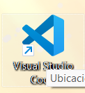
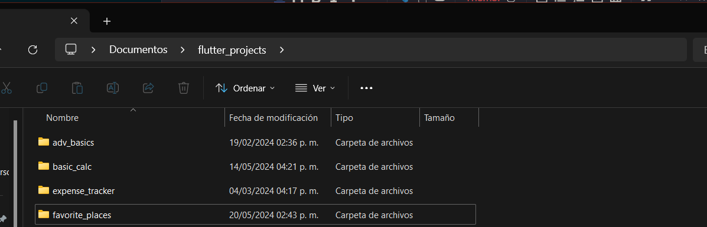
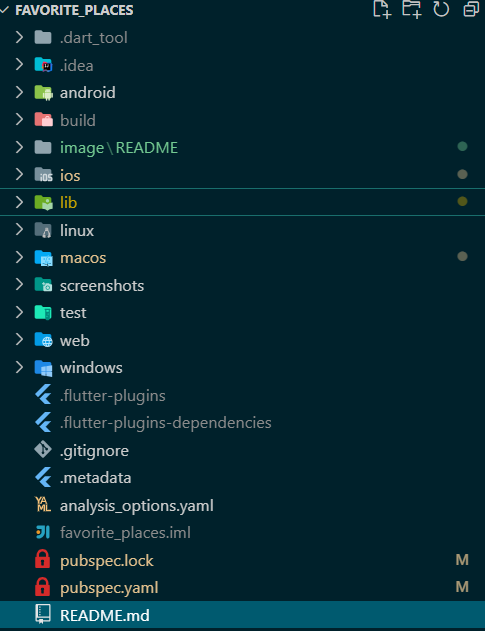
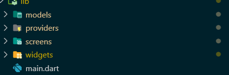
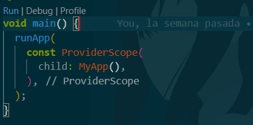
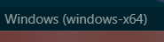
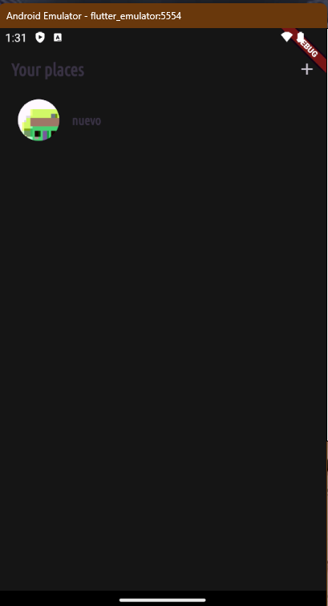
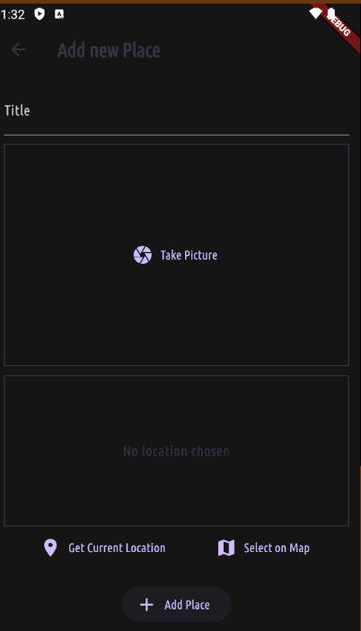
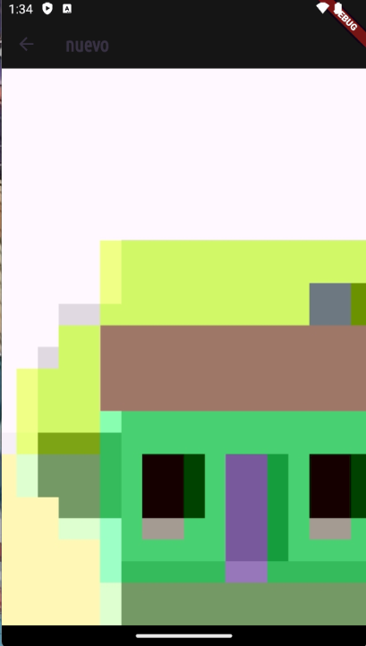

# favorite_places

Aplicación que permite tomar foto de lugares y agregar la información empleando la libreria location de flutter

## Descarga e instalación.

Ejecutar los siguientes comandos

Paso 1: Clonar el repositorio

```nginx
git clone https://github.com/LuisFer27/app_test.git

```

Paso 2 :Abrir visual studio code



Paso 3 seleccionar la carpeta en donde se guardo el repositorio en la opción  archivo y abrir carpeta


se selecciona la carpeta en donde esta ubicado el repositorio ya que en este caso esta almacenado en documentos pero puede variar según el lugara en de lo tengas descargado



Paso 4  una vez abierta la carpeta nos apareceran todas estas carpetas sin embargo la que nos interesa es la de lib en donde se alamcena todo los archivos dart para la ejecución de la aplicación



Paso 5 abriremos la carpeta lib y nos dirigiremos al archivo main .dart



abrimos el archivo main.dart y se nos visualizara de esta forma

```dart
import 'package:favorite_places/screens/places.dart';
import 'package:flutter/material.dart';
import 'package:flutter_riverpod/flutter_riverpod.dart';
import 'package:google_fonts/google_fonts.dart';

final colorScheme = ColorScheme.fromSeed(
  brightness: Brightness.dark,
  seedColor: const Color.fromARGB(255, 102, 6, 247),
  background: const Color.fromARGB(255, 56, 49, 66),
);

final theme = ThemeData().copyWith(
  useMaterial3: true,
  scaffoldBackgroundColor: colorScheme.background,
  colorScheme: colorScheme,
  textTheme: GoogleFonts.ubuntuCondensedTextTheme().copyWith(
    titleSmall: GoogleFonts.ubuntuCondensed(
      fontWeight: FontWeight.bold,
    ),
    titleMedium: GoogleFonts.ubuntuCondensed(
      fontWeight: FontWeight.bold,
    ),
    titleLarge: GoogleFonts.ubuntuCondensed(
      fontWeight: FontWeight.bold,
    ),
  ),
);

void main() {
  runApp(
    const ProviderScope(
      child: MyApp(),
    ),
  );
}

class MyApp extends StatelessWidget {
  const MyApp({Key? key}) : super(key: key);

  @override
  Widget build(BuildContext context) {
    return MaterialApp(
      title: 'Great Places',
      theme: theme,
      home: const PlacesScreen(),
    );
  }
}

```

en este caso en el editor le daremos click en run


depende del dispositivo que dispongamos este se ejecutar si no podemos cambiarlo abajo de nuestra editor 

y escoger nuestro dispositivo principalmente movil ya que en este caso podemos seleccionar movil o virtual como en este ejemplo


## Funcionalidad.



boton de más permite agregar un nuevo registro apartir de un formulario 



Formulario permite agregar un nuevo lufgar tomando una foto 

Title permite meter un titulo con referente a la foto 

Take picture permite agregar una foto nueva 

Add place permite agregar el lugar 

Lista Permite visualizar una foto de esta forma 



```

```
